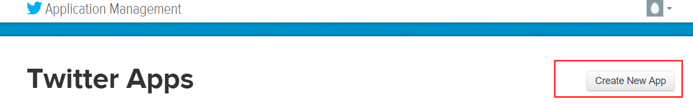
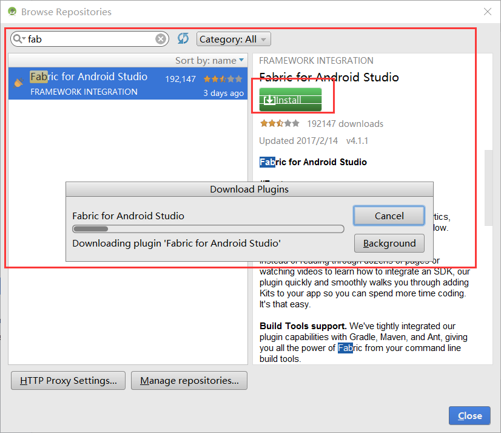
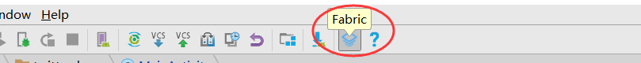

# TwitterDemo

### 1. 登陆[Twitter开发者中心](https://dev.twitter.com/),点击My Apps，创建app
### 2. 创建app
### 3. 进入app信息界面，设置读写权限
### 4. 获取API Key和API Secret
### 5. 安装Fabric,使用Fabric进行Twitter和相关SDK的安装。详细请阅读[官方文档](https://docs.fabric.io/android/index.html)。首先进入AndroidStudio，打开File->settings->Plugins->Browse repositories.. 搜索Fabric 点击安装
### 6. 重启AndroidStudio,工具栏上蓝色按钮就是启动Twitter 的 Fabric了。
### 7. 点开蓝色按钮的Fabric，进入Fabric程序页面，然后根据提示在Fabric上注册,然后再登录。进入如下页面
### 8. 点击红框处的按钮（如果没有按钮，请先点击红色箭头处的下拉箭头），进入各类SDK选择界面，选择椭圆框标记的Twitter，然后根据提示进行安装。（另外三个红框里的SDK是与数据采集分析和bug上传相关的，可根据需要选择安装）
### 9. 安装SDK的时候，Fabric已经把基本的代码都写好了（如：avtivity的注册，sdk的初始化等），这里要注意把KEY和SECRET换成前面注册App获取的Key和Secret。
### 10. 最后调分享接口即可。
## ***详细请查看Demo***